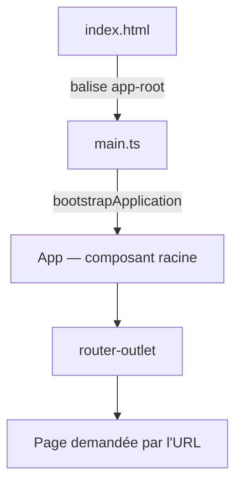

[Sommaire](Readme.md) · [02 · Le composant de page →](02-composant-page.md)

# L'application

Une application Angular démarre comme une page web : le navigateur charge `index.html`, puis le script compilé depuis `main.ts` lance le framework. Le composant racine s'affiche, et le routeur y insère la page demandée. Connaître ce trajet, c'est savoir où ranger chaque chose — et où chercher quand rien ne s'affiche.

## L'essentiel

### 1. Le point d'entrée

`src/main.ts`

```ts
import { bootstrapApplication } from '@angular/platform-browser';
import { appConfig } from './app/app.config';
import { App } from './app/app';

bootstrapApplication(App, appConfig)
  .catch((err) => console.error(err));
```

`src/index.html` contient la balise du composant racine :

```html
<app-root></app-root>
```

Au chargement, `bootstrapApplication` crée le composant `App` et l'affiche dans `<app-root>` ; en cas d'échec, `catch` affiche l'erreur dans la console. Tout le reste de l'application vit à l'intérieur de ce composant.

### 2. Le composant racine et sa configuration

`src/app/app.ts` — le composant racine. La CLI le génère avec une page de démonstration ; une fois celle-ci retirée, il n'est qu'une coquille autour du routeur :

```ts
@Component({
  imports: [RouterOutlet],
  selector: 'app-root',
  styleUrl: './app.css',
  templateUrl: './app.html', // ne contient plus que <router-outlet />
})
export class App {}
```

`src/app/app.config.ts` — les **providers** : les fonctionnalités mises à disposition de toute l'application (routeur, HTTP…), déclarées une seule fois :

```ts
export const appConfig: ApplicationConfig = {
  providers: [
    provideBrowserGlobalErrorListeners(), // transmet les erreurs non capturées à Angular
    provideRouter(routes),                // routes : la table de app.routes.ts
  ],
};
```

### 3. Le démarrage, de bout en bout



### 4. La structure d'un projet

| Fichier ou dossier | Rôle |
|---|---|
| `src/main.ts` | Point d'entrée : démarre l'application |
| `src/index.html` | Page hôte, balise du composant racine |
| `src/app/app.ts` | Composant racine (coquille), avec `app.html` et `app.css` |
| `src/app/app.config.ts` | Providers : routeur, HTTP… |
| `src/app/app.routes.ts` | Table des routes |
| `src/app/features/` | Les pages et leurs composants |
| `src/app/domain/` | Le code métier, sans aucun import Angular |

### 5. Sans zone.js

Historiquement, Angular s'appuyait sur la bibliothèque zone.js pour savoir quand rafraîchir l'écran. Angular 22 s'en passe (*zoneless*) : la détection de changements repose sur les signaux — quand un signal lu dans un template change, Angular met à jour ce composant, et lui seul.

## Pièges courants

- **Ouvrir `index.html` directement dans le navigateur** : page blanche, rien ne s'exécute. En développement, on lance `ng serve` ; pour publier, `ng build`.
- **Déclarer les providers dans le composant racine** plutôt que dans `app.config.ts` : les services, gardes et intercepteurs ne les voient pas, et `provideRouter()` y est même refusé.
- **Chercher un `AppModule`** : les applications Angular 22 n'ont plus de module global — les composants sont *standalone* et importent directement ce qu'ils utilisent.

## Approfondir

- [Structure d'un projet — angular.dev](https://angular.dev/reference/configs/file-structure) (en anglais)
- Cours Angular : chapitre [03 · Les outils et la création du projet](https://github.com/DiginamicAcademy/Angular/blob/main/03-environnement-tooling.md)

---

[Sommaire](Readme.md) · [02 · Le composant de page →](02-composant-page.md)
