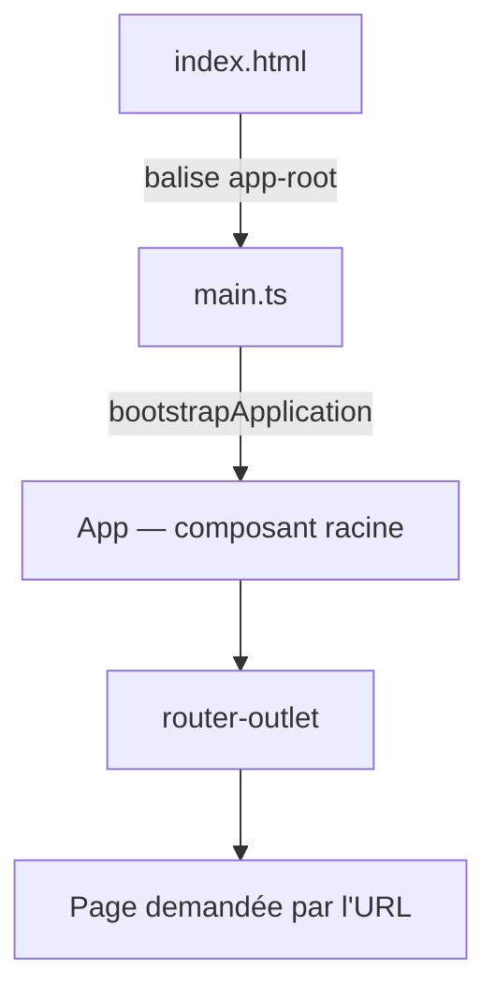

[Sommaire](Readme.md) · [02 · Le composant de page →](02-composant-page.md)

# L'application

Une application Angular démarre comme n'importe quelle page web : le navigateur charge `index.html`, qui déclenche le démarrage du framework. Le composant racine s'affiche, le routeur prend le relais. Savoir ce qui se passe entre les deux, c'est savoir où ranger chaque chose — et où chercher quand rien ne s'affiche.

## L'essentiel

### 1. Le point d'entrée

`src/main.ts`

```ts
import { bootstrapApplication } from '@angular/platform-browser';
import { appConfig } from './app/app.config';
import { App } from './app/app';

bootstrapApplication(App, appConfig);
```

`src/index.html` contient la balise du composant racine :

```html
<app-root></app-root>
```

Au chargement, `main.ts` instancie `App` et l'insère dans `<app-root>`. Tout le reste de l'application vit à l'intérieur de ce composant.

### 2. Le composant racine et sa configuration

`src/app/app.ts` — le composant racine, souvent réduit à la coquille de l'application :

```ts
@Component({
  selector: 'app-root',
  imports: [RouterOutlet],
  template: `<router-outlet />`,
})
export class App {}
```

`src/app/app.config.ts` — les **providers** de l'application, déclarés une seule fois :

```ts
export const appConfig: ApplicationConfig = {
  providers: [provideRouter(appRoutes)],
};
```

### 3. Le démarrage, de bout en bout



### 4. La structure d'un projet

| Fichier ou dossier | Rôle |
|---|---|
| `src/main.ts` | Point d'entrée : démarre l'application |
| `src/index.html` | Page hôte, balise du composant racine |
| `src/app/app.ts` | Composant racine (coquille) |
| `src/app/app.config.ts` | Providers : routeur, HTTP… |
| `src/app/app.routes.ts` | Table des routes |
| `src/app/features/` | Les pages et leurs composants |
| `src/app/domain/` | Le métier, sans aucun import Angular |

Angular 22 fonctionne **sans zone.js** (*zoneless*) : la détection de changements repose sur les signaux — quand un signal lu dans un template change, Angular met à jour ce composant, et lui seul.

## Pièges courants

- **Ouvrir `index.html` directement dans le navigateur** : rien ne s'exécute. Une application Angular se sert avec `ng serve`, se construit avec `ng build`.
- **Mettre des providers dans le composant racine** plutôt que dans `app.config.ts` : ils ne seraient fournis qu'à ce composant et à ses descendants.
- **Chercher un `AppModule`** : les applications Angular 22 n'ont plus de module global — les composants sont *standalone* et importent directement ce qu'ils utilisent.

## Approfondir

- [Démarrage d'une application — angular.dev](https://angular.dev/guide/startup) (en anglais)
- Cours Angular : chapitre [03 · Les outils et la création du projet](https://github.com/DiginamicAcademy/Angular/blob/main/03-environnement-tooling.md)

---

[Sommaire](Readme.md) · [02 · Le composant de page →](02-composant-page.md)
