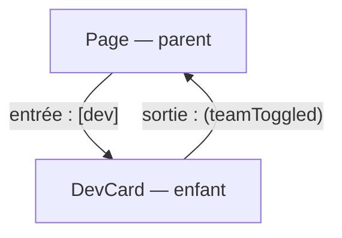

[← 01 · L'application](01-app.md) · [Sommaire](Readme.md) · [03 · Le routeur →](03-routeur.md)

# Le composant de page

Le composant est la brique d'interface d'Angular : un état, un template, des styles. La **page** est un composant comme les autres — celui que le routeur affiche dans `<router-outlet />`. Une application, c'est un arbre de composants : les données descendent par les **entrées**, les événements remontent par les **sorties**.

## L'essentiel

### 1. Anatomie

`src/app/features/devs/dev-card.ts`

```ts
@Component({
  selector: 'app-dev-card',        // la balise : <app-dev-card />
  imports: [DevAvatar],            // composants, directives et pipes utilisés
  templateUrl: './dev-card.html',  // ou template: `...` en ligne
  styleUrl: './dev-card.css',      // ou styles: `...`
})
export class DevCard {
  readonly dev = input.required<Dev>();       // entrée obligatoire
  readonly team = input.required<number[]>(); // entrée : ids de l'équipe
  readonly teamToggled = output<number>();    // sortie : événement
  protected readonly inTeam = computed(() => this.team().includes(this.dev().id));
}
```

- Les composants sont *standalone* : `imports` liste ce que le template utilise, plus de module à déclarer.
- Les styles sont **encapsulés** : `.card` dans `dev-card.css` ne touche que ce composant.
- Angular 22 applique `OnPush` par défaut : quand un signal lu dans le template change, Angular met à jour ce composant, et lui seul.
- Les entrées sont des **signaux**, l'état dérivé des `computed` : fiches [04 · signal()](04-signal.md) et [05 · computed()](05-computed.md).

### 2. Les liaisons de template

| Syntaxe | Rôle | Exemple |
|---|---|---|
| `{{ expr }}` | Interpolation (texte échappé) | `{{ dev().name }}` |
| `[prop]="expr"` | Propriété d'un élément ou entrée d'un composant | `[disabled]="teamFull()"` |
| `[class.x]="bool"` | Ajoute ou retire une classe | `[class.in-team]="inTeam()"` |
| `[style.x]="expr"` | Style en ligne, avec unité possible | `[style.width.%]="percent()"` |
| `(event)="instruction"` | Événement | `(click)="toggle(dev().id)"` |
| `#ref` | Référence locale vers un élément | `<input #search />` |

### 3. Le control flow

```html
@if (devs().length > 0) {
  <p>{{ devs().length }} dev(s)</p>
} @else {
  <p>Aucun dev.</p>
}

@for (dev of devs(); track dev.id) {
  <app-dev-card [dev]="dev" />
} @empty {
  <p>Aucun dev.</p>
}
```

`track` est obligatoire dans `@for` : il identifie chaque élément pour qu'Angular ne recrée que ce qui a changé.

### 4. Entrées et sorties



- `input.required<T>()` rend l'entrée obligatoire ; `input(valeur)` fournit un défaut.
- `output<T>()` déclare un événement ; l'enfant appelle `emit(valeur)`, le parent reçoit `$event`.
- Les données descendent, les événements remontent : l'enfant ne modifie jamais l'état du parent.

### 5. La page

Une page est un composant chargé par le routeur (fiche [03 · Le routeur](03-routeur.md)) et affiché dans `<router-outlet />`. Ses paramètres d'URL arrivent comme des entrées, grâce à `withComponentInputBinding()`.

## Pièges courants

- **Modifier un tableau en place** (`push`) : le signal ne voit pas de changement — on crée une nouvelle valeur (`[...ids, id]`).
- **Oublier un import dans `imports`** : le template ne connaît pas la balise, et le message d'erreur le dit.
- **Exposer l'état interne** : `protected readonly` pour ce que le template lit, `private readonly` pour le reste.

## Approfondir

- [Composants — angular.dev](https://angular.dev/guide/components) (en anglais)
- Cours Angular : chapitre [05 · Composants et signaux](https://github.com/DiginamicAcademy/Angular/blob/main/05-composants-signaux.md)

---

[← 01 · L'application](01-app.md) · [Sommaire](Readme.md) · [03 · Le routeur →](03-routeur.md)
