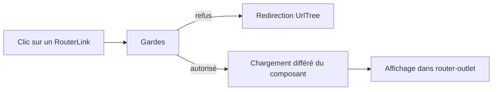

[← 02 · Le composant de page](02-composant-page.md) · [Sommaire](Readme.md) · [04 · signal() →](04-signal.md)

# Le routeur

Le routeur fait correspondre l'URL à une page : chaque adresse affiche un composant dans `<router-outlet />`, sans rechargement. L'URL devient un état de l'application — partageable, marquable, restaurée au rechargement.

## L'essentiel

### 1. La table des routes

`src/app/app.routes.ts`

```ts
export const appRoutes: Routes = [
  { path: '', component: DexPage },
  {
    path: 'devs/:id',
    loadComponent: () => import('./features/devs/dev-page').then((m) => m.DevPage),
  },
  { path: '**', component: NotFoundPage },
];
```

- `loadComponent` charge la page **à la demande** (*chargement différé*) : elle n'entre dans le bundle initial que si l'utilisateur la visite.
- `''` est la route racine ; `'**'` attrape tout le reste — toujours en **dernier**.

### 2. La navigation



`src/app/app.config.ts`

```ts
providers: [provideRouter(appRoutes, withComponentInputBinding())],
```

Dans un template :

```html
<a routerLink="/devs" routerLinkActive="active">Pokédex</a>
<a [routerLink]="['/devs', dev().id]">Fiche</a>
```

### 3. Les paramètres comme entrées

Avec `withComponentInputBinding()`, les paramètres d'URL alimentent directement les entrées du composant :

`src/app/features/devs/dev-page.ts`

```ts
export class DevPage {
  readonly id = input.required<number, string>({ transform: numberAttribute });
}
```

Un paramètre d'URL est toujours une chaîne : `numberAttribute` le convertit.

### 4. Les gardes

| Fonction | Question posée | Réponse |
|---|---|---|
| `CanActivateFn` | Peut-on entrer sur cette route ? | `true`, `false` ou une redirection (`UrlTree`) |
| `CanDeactivateFn` | Peut-on quitter cette page ? | `true` ou `false` |
| `ResolveFn` | Quelle donnée calculer avant l'affichage ? | une valeur |

Ce sont des **fonctions** ; elles peuvent appeler `inject()`.

`src/app/core/dev-id-guard.ts`

```ts
export const devIdGuard: CanActivateFn = (route) => {
  const id = Number(route.paramMap.get('id'));
  return Number.isInteger(id) && id > 0 ? true : inject(Router).parseUrl('/introuvable');
};
```

## Pièges courants

- **Oublier `provideRouter`** : les `routerLink` ne se comportent pas comme des liens.
- **Placer `'**'` avant les autres routes** : elle les avale toutes.
- **Lire un paramètre comme un nombre** : c'est une chaîne — `numberAttribute` en entrée, ou `Number()` explicite.
- **Protéger des données avec une garde** : une garde améliore l'expérience, elle ne **sécurise** rien — la vraie protection est côté serveur.

## Approfondir

- [Routing — angular.dev](https://angular.dev/guide/routing) (en anglais)
- Cours Angular : chapitre [08 · Routing](https://github.com/DiginamicAcademy/Angular/blob/main/08-routing.md)

---

[← 02 · Le composant de page](02-composant-page.md) · [Sommaire](Readme.md) · [04 · signal() →](04-signal.md)
