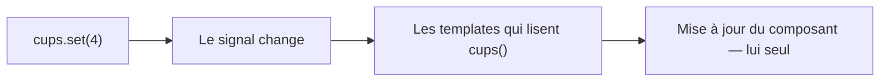

[← 03 · Le routeur](03-routeur.md) · [Sommaire](Readme.md) · [05 · computed() →](05-computed.md)

# signal()

Un **signal** contient une valeur et prévient Angular quand elle change : les templates qui le lisent se mettent à jour, et eux seuls. C'est la brique d'état d'Angular 22 — et ce qui lui permet de fonctionner sans zone.js.

## L'essentiel

### 1. Créer, lire, modifier

```ts
const cups = signal(0);        // état modifiable
cups();                       // lecture : on appelle le signal
cups.set(3);                  // remplacement
cups.update((n) => n + 1);     // calcul à partir de l'ancienne valeur
```

Dans un template, on l'appelle comme partout :

```html
<p>{{ cups() }} tasses</p>
<button type="button" (click)="cups.update((n) => n + 1)">Encore</button>
```

### 2. La mise à jour, de bout en bout



### 3. Toujours de nouvelles valeurs

Un signal compare par **référence**. On ne modifie jamais un tableau ou un objet en place : on en crée une nouvelle.

```ts
ids.update((list) => [...list, id]); // ✅ nouvelle référence
ids().push(id);                      // ❌ le signal ne voit rien
```

### 4. Les entrées sont des signaux

`input()` crée un signal en lecture seule alimenté par le parent (fiche [02 · Le composant de page](02-composant-page.md)) :

```ts
readonly dev = input.required<Dev>();
// dans un template : {{ dev().name }}
```

## Pièges courants

- **Lire sans appeler** : `{{ cups }}` affiche la fonction, `{{ cups() }}` affiche la valeur.
- **Modifier en place** : `push`, `splice` et compagnie ne déclenchent rien.
- **Dériver à la main** : tout ce qui peut être calculé à partir d'un autre état est un `computed`, jamais une copie tenue à jour à la main (fiche [05 · computed()](05-computed.md)).

## Approfondir

- [Signaux — angular.dev](https://angular.dev/guide/signals) (en anglais)
- Cours Angular : chapitre [05 · Composants et signaux](https://github.com/DiginamicAcademy/Angular/blob/main/05-composants-signaux.md)

---

[← 03 · Le routeur](03-routeur.md) · [Sommaire](Readme.md) · [05 · computed() →](05-computed.md)
