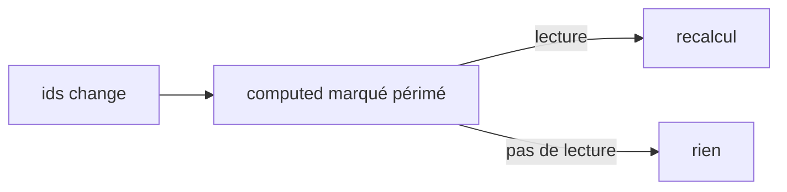

[← 04 · signal()](04-signal.md) · [Sommaire](Readme.md) · [06 · Les services →](06-service.md)

# computed()

`computed()` crée une valeur **dérivée** d'autres signaux : elle se recalcule quand l'un d'eux change, et seulement si quelqu'un la lit. La règle : tout ce qui se calcule à partir d'un autre état est un `computed`, jamais une copie synchronisée à la main.

## L'essentiel

### 1. Dériver

```ts
const cups = signal(0);
const energy = computed(() => (cups() > 3 ? 'survolté' : 'efficace')); // lecture seule
```

Dans un service :

```ts
readonly members = computed(() => this.ids().map((id) => this.repository.byId(id)));
readonly size = computed(() => this.ids().length);
```

(`repository` : le service qui charge les données — fiche [09 · Les appels HTTP](09-appels-http.md))

### 2. Mémoïsé : recalculé seulement si nécessaire

Le résultat est mis en cache (*mémoïsé*) : un `computed` ne se recalcule que si un signal qu'il lit a changé **et** que quelqu'un le lit. Dix lectures sans changement, zéro recalcul.



### 3. Les dépendances sont suivies automatiquement

Aucune liste de dépendances à écrire : un `computed` dépend des signaux qu'il a réellement lus lors de son dernier calcul, branche par branche.

```ts
const label = computed(() => (isAdmin() ? name() : 'anonyme'));
// si isAdmin() est true, name() est une dépendance ; sinon, non
```

### 4. En lecture seule

Un `computed` n'a ni `set` ni `update`. Pour un état dérivé **modifiable**, réinitialisé quand une source change, Angular fournit `linkedSignal()`.

## Pièges courants

- **Modifier quoi que ce soit dans un `computed`** (un signal, `localStorage`…) : il doit seulement calculer. Les effets de bord relèvent d'un `effect()`.
- **Lire une valeur non réactive** : un `computed` qui lit une simple propriété (pas un signal) ne se recalcule pas quand elle change.
- **Supposer des dépendances fixes** : elles dépendent des branches réellement exécutées.

## Approfondir

- [Signaux — angular.dev](https://angular.dev/guide/signals) (en anglais)
- Cours Angular : chapitres [05 · Composants et signaux](https://github.com/DiginamicAcademy/Angular/blob/main/05-composants-signaux.md) et [09 · État, persistance et architecture](https://github.com/DiginamicAcademy/Angular/blob/main/09-etat-persistance-architecture.md)

---

[← 04 · signal()](04-signal.md) · [Sommaire](Readme.md) · [06 · Les services →](06-service.md)
