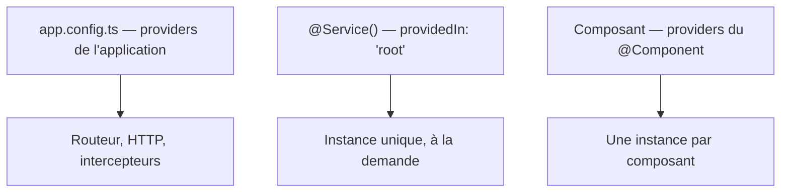

[← 05 · computed()](05-computed.md) · [Sommaire](Readme.md) · [07 · Les directives →](07-directive.md)

# Les services

Un service porte la logique et l'état **partagés** : données, appels HTTP, état d'une équipe. L'**injection de dépendances** fournit les instances : un composant demande `Team`, Angular lui donne *la* instance — toujours la même, créée une seule fois.

## L'essentiel

### 1. @Service() et inject()

`src/app/features/team/team.ts`

```ts
@Service() // ≡ @Injectable({ providedIn: 'root' }) — la forme historique
export class Team {
  private readonly repository = inject(DevRepository);
  private readonly ids = signal<number[]>([]);

  readonly members = computed(() => this.ids().map((id) => this.repository.byId(id)));
  readonly size = computed(() => this.ids().length);

  toggle(id: number): void {
    this.ids.update((list) =>
      list.includes(id) ? list.filter((i) => i !== id) : [...list, id],
    );
  }
}
```

- `@Service()` (Angular 22) remplace `@Injectable({ providedIn: 'root' })`, que vous verrez dans du code existant.
- `providedIn: 'root'` : une instance unique pour toute l'application, créée seulement si quelqu'un la demande.
- `inject()` s'appelle dans un champ — jamais d'injection par paramètre de constructeur.

### 2. Demander un service

```ts
export class DexPage {
  private readonly team = inject(Team);     // même instance partout
  protected readonly size = this.team.size; // computed exposé au template
}
```

### 3. Qui fournit quoi



### 4. Les valeurs qui ne sont pas des classes

Pour injecter une configuration (une URL, un paramètre), on utilise un `InjectionToken` :

```ts
export const API_URL = new InjectionToken<string>('api.url');
// fourniture : { provide: API_URL, useValue: 'https://api.exemple.fr' }
// lecture :     inject(API_URL)
```

## Pièges courants

- **Reconnaître `@Injectable` sans paniquer** : c'est la forme historique du même service — les deux cohabitent.
- **Garder l'état dans un composant** : dès que deux composants doivent le voir, il monte dans un service.
- **Appeler `inject()` hors contexte** (dans un callback, après l'initialisation) : erreur — capturez la dépendance dans un champ.

## Approfondir

- [Injection de dépendances — angular.dev](https://angular.dev/guide/di) (en anglais)
- Cours Angular : chapitre [06 · Services, injection et HTTP](https://github.com/DiginamicAcademy/Angular/blob/main/06-services-http.md)

---

[← 05 · computed()](05-computed.md) · [Sommaire](Readme.md) · [07 · Les directives →](07-directive.md)
