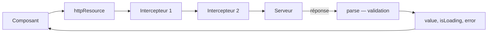

[← 08 · Les pipes](08-pipe.md) · [Sommaire](Readme.md) · [10 · La gestion de session →](10-gestion-session.md)

# Les appels HTTP

Parler au serveur recouvre deux besoins : **charger** des données, avec `httpResource`, qui expose la réponse sous forme de signaux ; et les **modifier** (`POST`, `DELETE`…), avec `HttpClient`.

## L'essentiel

### 1. Charger : httpResource

`src/app/features/devs/dev-repository.ts`

```ts
@Service()
export class DevRepository {
  private readonly remote = httpResource(() => 'data/devs.json', {
    parse: parseDevs,     // type guard : valider à la frontière
    defaultValue: [],
  });

  readonly devs = computed(() => (this.remote.hasValue() ? this.remote.value() : []));
  readonly loading = this.remote.isLoading;
}
```

- La fonction passée en premier argument est **réactive** : si elle lit un signal et que ce signal change, la requête est relancée. Si elle renvoie `undefined`, aucune requête n'est envoyée.
- L'URL est **relative**, sans `/` initial : l'application fonctionne aussi une fois publiée dans un sous-dossier.
- `parse` reçoit la réponse brute (`unknown`) et renvoie une valeur typée. C'est là qu'on **valide** les données, à la *frontière* : l'endroit où elles entrent dans l'application. Si `parse` lève une erreur, la ressource passe en erreur.
- **Lire `value()` sur une ressource en erreur lève une exception.** On teste d'abord `hasValue()`, dans un `computed`.
- `HttpClient` est disponible par défaut : `provideHttpClient()` ne sert qu'à ajouter des options, comme les intercepteurs.

### 2. Le trajet d'une requête



### 3. Modifier : HttpClient

```ts
private readonly http = inject(HttpClient);

async addDev(dev: Omit<Dev, 'id'>): Promise<void> {
  await firstValueFrom(this.http.post<Dev>('/api/devs', dev));
  this.remote.reload(); // rafraîchir la ressource
}
```

`HttpClient` renvoie un `Observable` ; `firstValueFrom` le convertit en `Promise`, qu'on peut attendre avec `await`. Une fois la modification faite, `reload()` recharge les données.

### 4. Les intercepteurs

Un intercepteur s'exécute pour **chaque** requête : idéal pour ajouter un en-tête, journaliser, afficher un indicateur de chargement ou retenter un appel.

`src/app/core/loading-interceptor.ts`

```ts
export const loadingInterceptor: HttpInterceptorFn = (req, next) => {
  // avant la requête
  return next(req).pipe(finalize(() => { /* après, succès ou erreur */ }));
};
```

`next(req)` renvoie un `Observable` RxJS. C'est l'un des rares endroits où RxJS reste nécessaire : `pipe` et `finalize` suffisent ici.

Enregistrement dans `app.config.ts` :

```ts
provideHttpClient(withInterceptors([loadingInterceptor])),
```

Angular 22 envoie ses requêtes avec l'API **Fetch** du navigateur, et non plus `XMLHttpRequest` ; `withXhr()` rétablit ce dernier si un cas l'exige.

## Pièges courants

- **Ne pas valider la réponse** : sans `parse`, la donnée reste `unknown`. Validez à la frontière.
- **Lire `value()` sans précaution** : sur une ressource en erreur, l'appel lève une exception — passez par `hasValue()`.
- **Oublier `reload()` après une modification** : la ressource affiche toujours les anciennes données.
- **Écrire un service HTTP fourre-tout** : une ressource correspond à une donnée et à ses dépendances réactives, pas à tous les appels de l'application.

## Approfondir

- [HTTP Client — angular.dev](https://angular.dev/guide/http) (en anglais)
- Cours Angular : chapitre [06 · Services, injection et HTTP](https://github.com/DiginamicAcademy/Angular/blob/main/06-services-http.md)

---

[← 08 · Les pipes](08-pipe.md) · [Sommaire](Readme.md) · [10 · La gestion de session →](10-gestion-session.md)
