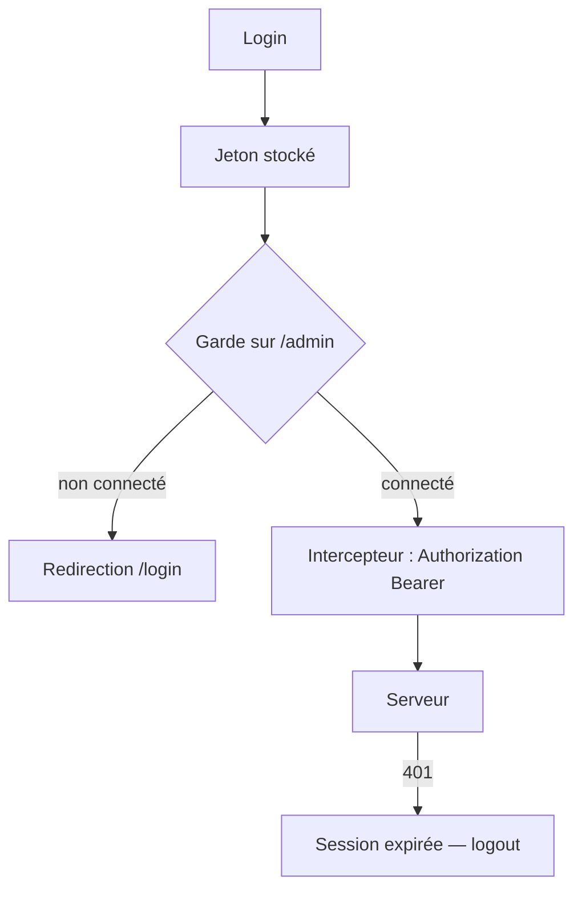

[← 09 · Les appels HTTP](09-appels-http.md) · [Sommaire](Readme.md) · [11 · WebSocket →](11-websocket.md)

# La gestion de session

Qui est connecté ? La session regroupe trois briques : un **service** qui détient l'utilisateur et le jeton, une **garde** qui écarte les visiteurs non connectés des pages privées, un **intercepteur** qui joint le jeton à chaque appel. Cette fiche va au-delà du cours — le projet Pokedev n'a pas de connexion.

## L'essentiel

### 1. Le service de session

`src/app/core/session/session.ts`

```ts
@Service()
export class Session {
  private readonly http = inject(HttpClient);

  // clé versionnée : changer de format = changer de clé (session.v2)
  // storedToken() : lit la clé dans localStorage, null si absente
  readonly token = signal<string | null>(storedToken('session.v1'));
  readonly user = signal<User | null>(null);
  readonly isLoggedIn = computed(() => this.user() !== null);

  async login(email: string, password: string): Promise<void> {
    const { token, user } = await firstValueFrom(
      this.http.post<LoginResponse>('/api/login', { email, password }),
    );
    localStorage.setItem('session.v1', JSON.stringify({ token }));
    this.token.set(token);
    this.user.set(user);
  }

  logout(): void {
    localStorage.removeItem('session.v1');
    this.token.set(null);
    this.user.set(null);
  }
}
```

L'état de session est en **signaux** : templates et gardes le lisent réactivement.

### 2. La garde d'authentification

`src/app/core/session/auth-guard.ts`

```ts
export const authGuard: CanActivateFn = () => {
  const session = inject(Session);
  return session.isLoggedIn() ? true : inject(Router).parseUrl('/login');
};
```

```ts
{ path: 'admin', canActivate: [authGuard], loadComponent: () => import('./features/admin/admin-page').then((m) => m.AdminPage) },
```

### 3. L'intercepteur de jeton

`src/app/core/session/token-interceptor.ts`

```ts
export const tokenInterceptor: HttpInterceptorFn = (req, next) => {
  const token = inject(Session).token();
  return next(token ? req.clone({ setHeaders: { Authorization: `Bearer ${token}` } }) : req);
};
```

### 4. Le circuit complet



Une garde améliore l'expérience utilisateur, elle ne **sécurise** rien : le jeton seul décide côté serveur, et chaque réponse `401` doit déconnecter proprement.

## Pièges courants

- **Stocker le mot de passe** : jamais. Le jeton seul — et de préférence en **cookie httpOnly** (inaccessible au JavaScript) si votre serveur le permet ; `localStorage` reste lisible par toute faille XSS.
- **Garder l'état après déconnexion** : `logout()` vide le jeton **et** l'utilisateur.
- **Protéger l'affichage, pas les données** : des routes gardées côté front n'empêchent rien côté API — chaque requête serveur doit vérifier le jeton.

## Approfondir

- [Sécurité — angular.dev](https://angular.dev/best-practices/security) (en anglais)
- Cours Angular : chapitres [06 · Services, injection et HTTP](https://github.com/DiginamicAcademy/Angular/blob/main/06-services-http.md) et [09 · État, persistance et architecture](https://github.com/DiginamicAcademy/Angular/blob/main/09-etat-persistance-architecture.md)

---

[← 09 · Les appels HTTP](09-appels-http.md) · [Sommaire](Readme.md) · [11 · WebSocket →](11-websocket.md)
