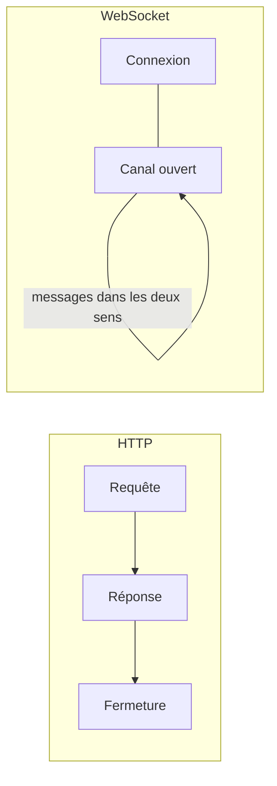

[← 10 · La gestion de session](10-gestion-session.md) · [Sommaire](Readme.md) · [12 · Les tests avec Vitest →](12-tests-vitest.md)

# WebSocket

Une requête HTTP obtient une réponse, puis l'échange est terminé. Un **WebSocket** reste ouvert : le serveur peut envoyer des messages à tout moment, sans qu'on les demande — chat, notifications, tableaux de bord en direct. Angular n'a pas d'outil dédié : on combine la fonction `webSocket` de RxJS et des signaux. Cette fiche va au-delà du cours.

## L'essentiel

### 1. HTTP contre WebSocket



### 2. Un service de socket

`src/app/core/realtime/notifications.ts`

```ts
import { webSocket } from 'rxjs/webSocket';

@Service()
export class Notifications {
  readonly status = signal<'connecting' | 'open' | 'closed'>('connecting');
  readonly messages = signal<Notification[]>([]);

  private socket$?: WebSocketSubject<Notification>;
  private delay = 1000;

  connect(): void {
    this.status.set('connecting');
    this.socket$ = webSocket<Notification>('/ws/notifications');
    this.socket$.subscribe({
      next: (message) => {
        this.status.set('open');
        this.delay = 1000;
        this.messages.update((list) => [...list, message]);
      },
      error: () => {
        this.status.set('closed');
        this.delay = Math.min(this.delay * 2, 30_000); // délai croissant
        setTimeout(() => this.connect(), this.delay);
      },
    });
  }

  send(message: Notification): void {
    this.socket$?.next(message);
  }
}
```

- `webSocket()` crée un `WebSocketSubject` : on appelle `next()` pour envoyer, on s'y abonne (`subscribe`) pour recevoir.
- En cas d'erreur, le service se reconnecte après un délai qui double à chaque échec, plafonné à 30 secondes ; dès qu'un message arrive, le délai revient à 1 seconde.

### 3. Afficher les messages

```html
@for (message of messages(); track message.id) {
  <p>{{ message.text }}</p>
} @empty {
  <p>Aucune notification.</p>
}
```

### 4. Fermer proprement

Un service `@Service()` vit aussi longtemps que l'application. Un socket ouvert par un **composant**, lui, doit être fermé quand le composant est détruit :

```ts
export class NotificationsPage {
  private readonly destroyRef = inject(DestroyRef);
  private readonly socket$ = webSocket<Notification>('/ws/notifications');

  protected readonly messages = signal<Notification[]>([]);

  constructor() {
    this.socket$.subscribe((message) => this.messages.update((list) => [...list, message]));
    this.destroyRef.onDestroy(() => this.socket$.complete()); // ferme le socket avec la page
  }
}
```

`DestroyRef.onDestroy()` est l'alternative moderne au hook `ngOnDestroy()` ; `complete()` ferme le sujet, et avec lui la connexion.

## Pièges courants

- **Oublier de fermer le socket** : la connexion survit à la page — ressources serveur gaspillées, messages reçus pour rien.
- **Se reconnecter sans délai** : un serveur en panne est bombardé de tentatives, ce qui aggrave la panne et peut faire bloquer le client. Espacez les tentatives avec un délai croissant.
- **Faire confiance aux messages** : ils viennent du réseau, comme une réponse HTTP — validez-les à la frontière (fiche [09](09-appels-http.md)).
- **Oublier d'authentifier le socket** : l'intercepteur HTTP ne s'applique pas aux WebSockets. Transmettez le jeton dans le premier message, ou en paramètre à l'ouverture.

## Approfondir

- [webSocket — RxJS](https://rxjs.dev/api/webSocket/webSocket) (en anglais)
- [WebSocket — MDN](https://developer.mozilla.org/fr/docs/Web/API/WebSocket) (en français)
- Cours Angular : chapitre [06 · Services, injection et HTTP](https://github.com/DiginamicAcademy/Angular/blob/main/06-services-http.md), pour la place de RxJS dans une application à signaux

---

[← 10 · La gestion de session](10-gestion-session.md) · [Sommaire](Readme.md) · [12 · Les tests avec Vitest →](12-tests-vitest.md)
