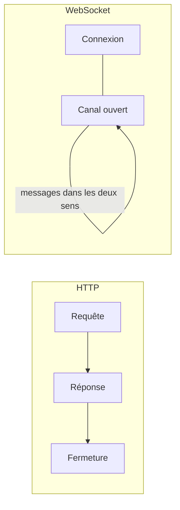

[← 10 · La gestion de session](10-gestion-session.md) · [Sommaire](Readme.md) · [12 · Les tests avec Vitest →](12-tests-vitest.md)

# WebSocket

HTTP répond puis ferme. Un **WebSocket** reste ouvert : le serveur peut pousser à tout moment — chat, notifications, tableaux de bord vivants. Angular n'impose rien ici : on combine le `webSocket` de RxJS et des signaux. Cette fiche va au-delà du cours.

## L'essentiel

### 1. HTTP contre WebSocket



### 2. Un service de socket

`src/app/core/realtime/notifications.ts`

```ts
import { webSocket } from 'rxjs/webSocket';

@Service()
export class Notifications {
  readonly status = signal<'connecting' | 'open' | 'closed'>('connecting');
  readonly messages = signal<Notification[]>([]);

  private socket$?: WebSocketSubject<Notification>;
  private delay = 1000;

  connect(): void {
    this.status.set('connecting');
    this.socket$ = webSocket<Notification>('/ws/notifications');
    this.socket$.subscribe({
      next: (message) => {
        this.status.set('open');
        this.delay = 1000;
        this.messages.update((list) => [...list, message]);
      },
      error: () => {
        this.status.set('closed');
        this.delay = Math.min(this.delay * 2, 30_000); // délai croissant
        setTimeout(() => this.connect(), this.delay);
      },
    });
  }

  send(message: Notification): void {
    this.socket$?.next(message);
  }
}
```

- `webSocket()` crée un `WebSocketSubject` : on y `next()` pour envoyer, on s'y abonne pour recevoir.
- Chaque message **valide** aussi à la frontière : un `parse`-like, comme pour HTTP (fiche [09](09-appels-http.md)).

### 3. Afficher les messages

```html
@for (message of messages(); track message.id) {
  <p>{{ message.text }}</p>
} @empty {
  <p>Aucune notification.</p>
}
```

### 4. Fermer proprement

Un service vit autant que l'application ; un socket qui appartient à un **composant** doit mourir avec lui :

```ts
protected readonly messages = toSignal(
  this.socket$.pipe(takeUntilDestroyed(this.destroyRef)),
  { initialValue: [] as ChatMessage[] },
);
```

`takeUntilDestroyed` (de `@angular/core/rxjs-interop`) coupe l'abonnement — et le socket — à la destruction du composant.

## Pièges courants

- **Ne jamais fermer** : un socket oublié fuit — connexions serveur saturées, messages reçus pour rien.
- **Reconnecter en boucle** : sans délai croissant, un serveur down reçoit une requête de connexion par instant — et vous un ban.
- **Faire confiance aux messages** : ils viennent du réseau comme une réponse HTTP — validez-les à la frontière.
- **Authentifier le socket** : le jeton ne passe pas par l'intercepteur HTTP — premier message envoyé, ou paramètre à l'ouverture.

## Approfondir

- [webSocket — RxJS](https://rxjs.dev/api/webSocket/webSocket) (en anglais)
- [WebSocket — MDN](https://developer.mozilla.org/fr/docs/Web/API/WebSocket) (en français)
- Cours Angular : chapitre [06 · Services, injection et HTTP](https://github.com/DiginamicAcademy/Angular/blob/main/06-services-http.md) — RxJS, l'exception assumée

---

[← 10 · La gestion de session](10-gestion-session.md) · [Sommaire](Readme.md) · [12 · Les tests avec Vitest →](12-tests-vitest.md)
