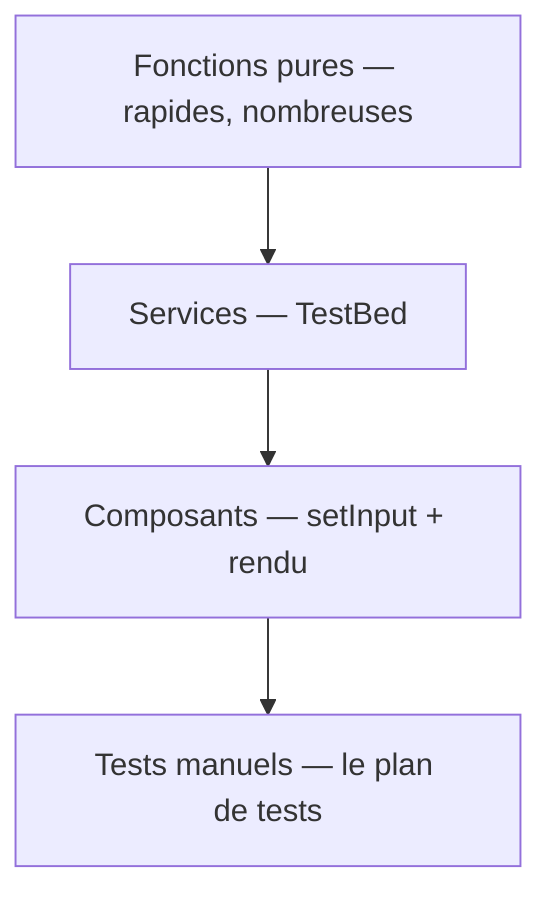

[← 11 · WebSocket](11-websocket.md) · [Sommaire](Readme.md)

# Les tests avec Vitest

Tester, c'est vérifier le **comportement** sans cliquer : une fonction pure, un service, un composant. Vitest est le lanceur de tests par défaut des projets Angular 22 — `ng test` le démarre, rien à installer.

## L'essentiel

### 1. Un fichier de test

Les fichiers se nomment `*.spec.ts`, à côté du fichier testé.

`src/app/domain/score.spec.ts`

```ts
describe('score', () => {
  it('additionne les statistiques', () => {
    expect(totalScore({ code: 35, debug: 20 })).toBe(55);
  });

  it.each([
    [0, 'Stagiairon'],
    [80, 'Seniorgon'],
  ])('classe %i en %s', (score, expected) => {
    expect(rankOf(score)).toBe(expected);
  });
});
```

### 2. Les commandes

| Commande | Effet |
|---|---|
| `npx ng test` | Lance les tests en continu (watch) |
| `npx ng test --watch=false` | Une seule passe |
| `npx ng test --watch=false --coverage` | Mesure la couverture |

### 3. Tester un service avec TestBed

`src/app/features/team/team.spec.ts`

```ts
describe('Team', () => {
  it('ajoute puis retire un dev', () => {
    const team = TestBed.inject(Team);
    team.toggle(1);
    expect(team.size()).toBe(1);
    team.toggle(1);
    expect(team.size()).toBe(0);
  });
});
```

Quand le service lit une **ressource** (`httpResource`), l'ordre est `tick` → `flush` → `whenStable` : on fait avancer le temps, puis on attend que la ressource se stabilise.

### 4. Tester un composant

```ts
const fixture = TestBed.createComponent(DevCard);
fixture.componentRef.setInput('dev', devFixture); // alimente une entrée
fixture.detectChanges();                         // déclenche le rendu
expect(fixture.componentInstance.inTeam()).toBe(false);
```

Avec une ressource dans le composant, `TestBed.tick()` fait avancer requêtes et rendu ensemble.

### 5. Les doublures

| Outil | Usage |
|---|---|
| `vi.spyOn(objet, 'méthode')` | Observer les appels |
| `.mockReturnValue(x)` / `.mockResolvedValue(x)` | Remplacer un résultat |
| `provideHttpClientTesting()` | Simuler les réponses HTTP |
| `vi.restoreAllMocks()` | Rétablir les originaux |

### 6. La pyramide



Le domaine (`domain/`) se teste sans Angular — c'est le signe qu'il est bien isolé.

## Pièges courants

- **Tester l'implémentation, pas le comportement** : on vérifie ce que la fonction **fait**, pas comment elle le fait.
- **Oublier l'ordre `tick` → `flush` → `whenStable`** avec `httpResource` : le test lit un état de chargement.
- **Mocker le domaine** : les fonctions pures se testent sans aucun doublon — si un test du domaine en réclame, le domaine a fui.

## Approfondir

- [Testing — angular.dev](https://angular.dev/guide/testing) (en anglais)
- Cours Angular : chapitre [11 · Tests](https://github.com/DiginamicAcademy/Angular/blob/main/11-tests.md)

---

[← 11 · WebSocket](11-websocket.md) · [Sommaire](Readme.md)
