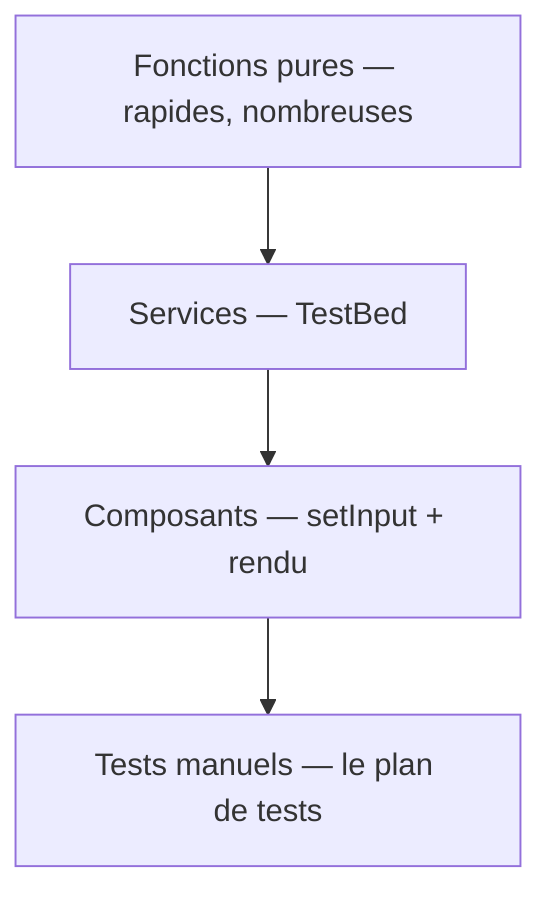

[← 11 · WebSocket](11-websocket.md) · [Sommaire](Readme.md) · [13 · Générer du code →](13-generer-du-code.md)

# Les tests avec Vitest

Un test vérifie automatiquement un **comportement** — celui d'une fonction pure, d'un service ou d'un composant — sans avoir à cliquer dans l'application. Vitest est le lanceur de tests par défaut des projets Angular 22 : `ng test` le démarre, rien à installer.

## L'essentiel

### 1. Un fichier de test

Un fichier de test se nomme `*.spec.ts` et se place à côté du fichier testé.

`src/app/domain/score.spec.ts`

```ts
describe('score', () => {
  it('additionne les statistiques', () => {
    expect(totalScore({ code: 35, debug: 20 })).toBe(55);
  });

  it.each([
    [0, 'Stagiairon'],
    [80, 'Seniorgon'],
  ])('classe %i en %s', (score, expected) => {
    expect(rankOf(score)).toBe(expected);
  });
});
```

`describe` regroupe des tests, `it` en décrit un, `expect` vérifie un résultat. `it.each` rejoue le même test sur plusieurs jeux de données.

### 2. Les commandes

| Commande | Effet |
|---|---|
| `npx ng test` | Lance les tests et les relance à chaque modification (*watch*) |
| `npx ng test --watch=false` | Lance les tests une seule fois |
| `npx ng test --watch=false --coverage` | Mesure aussi la couverture du code |

### 3. Tester un service avec TestBed

`src/app/features/team/team.spec.ts`

```ts
describe('Team', () => {
  beforeEach(() => {
    TestBed.configureTestingModule({
      providers: [provideHttpClient(), provideHttpClientTesting()], // Team charge ses devs par HTTP
    });
  });

  it('ajoute puis retire un dev', () => {
    const team = TestBed.inject(Team);
    team.toggle(1);
    expect(team.size()).toBe(1);
    team.toggle(1);
    expect(team.size()).toBe(0);
  });
});
```

`TestBed.inject` fournit le service comme le ferait l'application, avec ses dépendances. Le `Team` de la fiche 06 charge ses devs par HTTP : `provideHttpClientTesting()` remplace alors le vrai serveur par une doublure (voir § 5).

Si le service lit une **ressource** (`httpResource`), respectez l'ordre `tick` → `flush` → `whenStable` : `TestBed.tick()` déclenche la requête, `flush()` lui renvoie une réponse simulée, `whenStable()` attend que la ressource soit à jour.

### 4. Tester un composant

```ts
it('affiche un dev hors équipe', async () => {
  const fixture = TestBed.createComponent(DevCard);
  fixture.componentRef.setInput('dev', devFixture); // alimente une entrée
  fixture.componentRef.setInput('team', []);        // équipe vide
  await fixture.whenStable();                       // attendre le rendu
  expect(fixture.componentInstance.inTeam()).toBe(false);
});
```

Chaque entrée obligatoire (`input.required`) doit recevoir une valeur avant le rendu, sinon Angular lève une erreur. Si le composant contient une ressource, `TestBed.tick()` déclenche à la fois les requêtes et le rendu.

### 5. Les doublures

| Outil | Usage |
|---|---|
| `vi.spyOn(objet, 'méthode')` | Espionner une méthode : appels, arguments |
| `.mockReturnValue(x)` / `.mockResolvedValue(x)` | Imposer la valeur renvoyée (ou la promesse résolue) |
| `provideHttpClientTesting()` | Simuler les réponses HTTP |
| `vi.restoreAllMocks()` | Rétablir les méthodes d'origine |

### 6. La pyramide

Beaucoup de tests rapides, peu de tests coûteux :



Le domaine (`domain/`) se teste sans Angular : c'est le signe qu'il est bien isolé.

## Pièges courants

- **Tester l'implémentation, pas le comportement** : on vérifie ce que le code **fait**, pas comment il le fait — le test survit ainsi aux refactorisations.
- **Oublier l'ordre `tick` → `flush` → `whenStable`** avec `httpResource` : le test lit une ressource encore en chargement.
- **Mocker le domaine** : les fonctions pures se testent sans doublure. Si un test du domaine en réclame une, c'est que le domaine dépend de ce qu'il ne devrait pas.

## Approfondir

- [Testing — angular.dev](https://angular.dev/guide/testing) (en anglais)
- Cours Angular : chapitre [11 · Tests](https://github.com/DiginamicAcademy/Angular/blob/main/11-tests.md)

---

[← 11 · WebSocket](11-websocket.md) · [Sommaire](Readme.md) · [13 · Générer du code →](13-generer-du-code.md)
